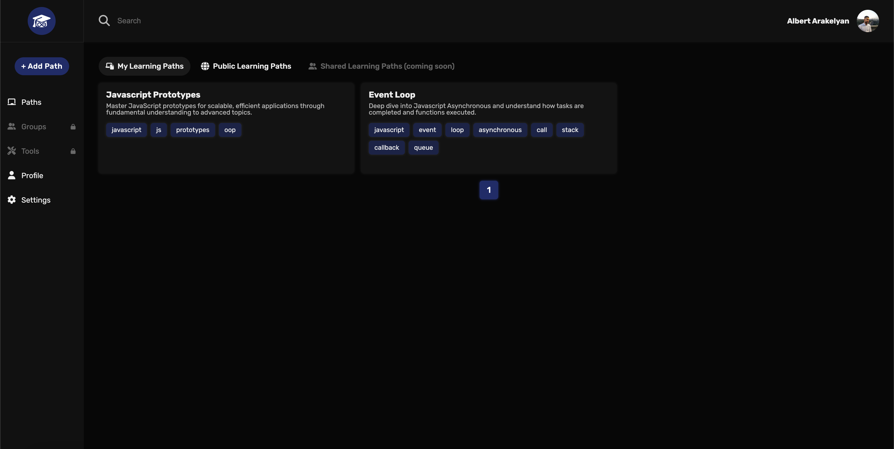

# 📖 Learnfinity Plus

> A modern and user-friendly app for creating and sharing **Learning Paths** written in React/Typescript and Express/Nodejs.




**What is a Learning Path?**  
A learning path is a structured guide that helps individuals achieve specific educational goals by organizing topics and resources in a logical sequence. It offers several benefits:

- Provides a clear roadmap for mastering a subject.
- Breaks down complex topics into manageable steps.
- Encourages consistent progress and self-paced learning.
- Facilitates skill development with tailored resources.

---

## 📝 About the project
A modern and user-friendly app for creating and sharing learning content only based on outer resources, find some great things on the internet then create an amazing Learning Path from them which will guarantee the desired skill.

## 🔑 Key Features
- Works on **Browser**
- Databse in **the Cloud** for **Users**
- Public **Learning Path** creation
- Private **Learning Path** creation
- **Settings** and **Profile** pages
- **Dark Theme** 😊

## 🙏 Donations
LearnfinityPlus is a free, open source software developed in my (little) spare time. If you liked the project and would like to support further development, please consider making a small donation, it really helps :)

<a href="https://www.buymeacoffee.com/albertarakelyan" target="_blank"></a>

## 👨‍💻Contibutors
People who helped the project along the way, thank you to all of you!

[](https://github.com/AlbertArakelyan/learnfinity/graphs/contributors)

## 🏰 Architecture
### Backend
Standard adjusted [Node.js](https://nodejs.org/en) + [Express.js](https://expressjs.com/) architecture based on different best practices with very good expressed **Data Access Layer**. For the database I have used [MongoDB](https://www.mongodb.com/) with [Mongoose](https://mongoosejs.com/) ODM.

### Frontend
Standard [React](https://reactjs.org/) + [Redux](https://redux.js.org/) with [Typescript](https://www.typescriptlang.org/) usage. Has been used a modified **View-Container** architecture with special hooks providing all the business logic to the **Container** giving an advantage of not writing prop types and interfaces for each component but extend from the ReturnType of the hook.

### Tech Stack
<table>
  <thead>
    <tr>
      <th>Frontend</th>
      <th>Backend</th>
    </tr>
  </thead>
  <tbody>
    <tr>
      <td>
        <div>
          
          
          
          
          
        </div>
      </td>
      <td>
        <div>
          
          
          
          
        </div>
      </td>
    </tr>
  </tbody>
</table>

## 📦 Installation
_Note: make sure you have `.env` created from `.env.example` with appropriate variables._

_Note: Make sure you are using correct `node` and `yarn` versions._

### Versions
- node: `20.10.0`
- npm: `10.2.3`
- yarn: `1.22.21`

### Repo
- Clone the repo
```bash
git clone https://github.com/AlbertArakelyan/learnfinity.git
```

### Server
*in `server` directory*
- Install dependencies
```bash
yarn
```

- Start the server
```bash
yarn dev
```

The development server will start running at: `http://localhost:8000`

### Client
*in `client` directory*
- Install dependencies
```bash
yarn
```

- Start the client
```bash
yarn start
```

The development client will start running at: `http://localhost:3000`

[//]: # (## 🚀 How to use)
